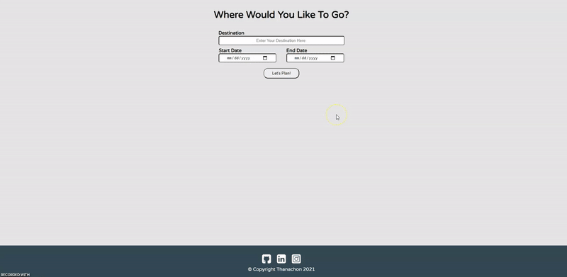

<!-- Add banner here -->

# My-Travel-App

<!-- Describe your project in brief -->
this project is part of Udacity front end web developer nanodegree program.

# Table of contents

- [My-Travel-App](#my-travel-app)
- [Table of contents](#table-of-contents)
- [Languages](#languages)
- [Install](#install)
- [How to get your API key](#how-to-get-your-api-key)
- [Dependencies](#dependencies)
- [Technology](#technology)

# Languages
[(Back to top)](#table-of-contents)

- HTML
- SCSS
- JavaScript

# Install
[(Back to top)](#table-of-contents)

1. clone this git on computer
2. install [node.js](https://nodejs.org/en/)
3. run command `npm install` on terminal
4. acquire your API key and replace it in *My-Travel-App\src\server\server.js*
5. run command `npm run prod` on terminal
6. run command `npm run start` on terminal
7. go to `http://localhost:8888/`
8. happy!

# How to get your API key
[(Back to top)](#table-of-contents)
[GeoName API](http://www.geonames.org/export/web-services.html)
[WeatherBit API](https://www.weatherbit.io/account/create)
[PixaBay API](https://pixabay.com/api/docs/)
[RestCountry API](https://restcountries.com/)

# Dependencies
[(Back to top)](#table-of-contents)

- `body-parser` version 1.19.0
- `cors` version 2.8.5
- `dotenv` version 10.0.0
- `express` version 4.17.1
- `node-fetch` version 3.1.0
- `webpack` version 5.63.0
- `webpack-cli` version 4.9.1
- `jest` version 27.4.3
- `node-fetch` version 3.1.0

# Technology
[(Back to top)](#table-of-contents)

- html
- css/scss
- javascript
- DOM
- node.js
- express.js
- API
- webpack
- service worker
- jest
